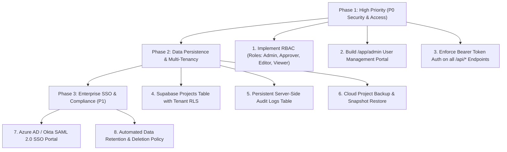

# Enterprise Readiness & Essential Requirements Audit Report
**Application:** VTAB Square — Qlik to Power BI Migration (`qliktopowerbi_balasir`)  
**Audit Date:** September 2026  
**Scope:** Full-stack assessment (Client UI, TanStack Router, Zustand Store, Server APIs, Supabase Auth, Compiler Engine)

---

## 1. Executive Summary

An exhaustive technical audit of the **21 Essential Requirements** was conducted against the current codebase.

### Status Overview
- **Fully Implemented (✅):** 11 / 21 (52.4%)
- **Partially Implemented (⚠️):** 8 / 21 (38.1%)
- **Not Implemented / Architecture Gap (❌):** 2 / 21 (9.5%)

```
┌──────────────────────────────────────────────────────────┐
│  Fully Implemented (52.4%)       [██████████░░░░░░░░░░]  │
│  Partially Implemented (38.1%)   [████████░░░░░░░░░░░░]  │
│  Not Implemented (9.5%)          [██░░░░░░░░░░░░░░░░░░]  │
└──────────────────────────────────────────────────────────┘
```

### High-Level Verdict
The core **compiler engine, Qlik-to-Power BI transformation, automated migration pipeline, UI/UX architecture, client-side data safety, and foundational authentication** are enterprise-grade and robust. The primary gaps lie in **multi-tenant server-side database persistence, role-based access control (RBAC), and an administrative user management portal**, which is typical when transitioning a client-first developer tool into a managed multi-tenant enterprise SaaS platform.

---

## 2. Requirement Compliance Matrix

| # | Area | Priority | Essential Requirement | Validation Method | Current Status | Codebase Reality & Findings |
|---|---|:---:|---|---|:---:|---|
| **1** | **Business purpose** | **P0** | Clear problem, target user, and expected outcome | Demonstrate one complete client use case | **Implemented (✅)** | Clear enterprise problem (Qlik to PBIP migration), targeted at BI engineers; demonstrated via 11-stage pipeline, rulebooks, and instructions. |
| **2** | **Core workflow** | **P0** | Main tasks work start to finish, with errors & retries | Run a documented end-to-end scenario | **Implemented (✅)** | 11-stage workflow (`StageNav`), QVS/QVW extraction, M generation, DAX translation, AI Auto-Fix retries, and PBIP ZIP export. |
| **3** | **UI / UX tests** | **P0** | UI / UX tests & validation | Verify visual design, state feedback, responsiveness | **Implemented (✅)** | 45 Vitest test suites, Radix UI accessible primitives, Lucide icons, Dark/Light modes, toast notifications, responsive Tailwind layout. |
| **4** | **Login** | **P0** | Secure authentication; no shared user accounts | Test valid login, failed login, logout, password reset | **Implemented (✅)** | Supabase Auth integration, 12+ char password complexity meter, 6-digit OTP verification, rate limit alerts, password recovery with signed HMAC tokens. |
| **5** | **Session security** | **P0** | Sessions expire; logout invalidates access | Try using app after logout or expiry | **Implemented (✅)** | JWT token expiry, automatic refresh, `AuthGuard` route shielding on `/app/*`, server-side 10-minute OTP expiration, local token purging on logout. |
| **6** | **Roles and permissions** | **P0** | Define who can view, create, approve, administer, export | Test each role against permitted/forbidden actions | **Partially Implemented (⚠️)** | All authenticated users currently receive full pipeline access. No fine-grained RBAC (e.g. Viewer, Editor, Approver, Admin) enforced in code or Supabase. |
| **7** | **Admin portal** | **P0** | Admin manages users, roles, settings, access without devs | Complete routine administration through UI | **Not Implemented (❌)** | No dedicated `/admin` route or UI for user management, role assignments, or tenant configurations in this repo. |
| **8** | **Client data isolation** | **P0** | One client or workspace cannot access another's data | Test access across tenants, workspaces, and APIs | **Partially Implemented (⚠️)** | In-memory client-side data isolation prevents cross-session leakage, but there is no persistent database multi-tenancy or server-side workspace isolation. |
| **9** | **Data protection** | **P0** | Encrypt traffic and stored data; secrets out of code | Review configuration and inspect deployed env | **Implemented (✅)** | HTTPS / HSTS enabled, strict Content Security Policy (CSP), secrets isolated in server `.env`, client instructed to scrub credentials before upload. |
| **10** | **Audit trail** | **P0** | Record logins, changes, approvals, exports, actions | Trace an action to user, time, and result | **Partially Implemented (⚠️)** | In-memory timestamped pipeline logs (`/app/logs`) and `migration-manifest.json` on export; persistent database audit logging is missing. |
| **11** | **Input and API security** | **P0** | Validate inputs and enforce permissions on server | Test invalid input and direct API access | **Partially Implemented (⚠️)** | Strong client validation + server input sanitization on auth; however, backend APIs (`/api/qvw/extract`, `/api/tom/status`) lack Bearer token authentication checks. |
| **12** | **Error handling** | **P0** | Show useful errors without revealing secrets/internals | Trigger failures in UI and inspect responses | **Implemented (✅)** | `sanitizeError` hides raw Supabase internals, `error-capture.ts` and `error-page.ts` intercept crashes, friendly UI banners and toasts. |
| **13** | **Backup and recovery** | **P0** | Back up client data and prove it can be restored | Perform a test restore | **Partially Implemented (⚠️)** | Full PBIP project ZIP, model JSON, and metadata can be exported and reloaded; automated cloud-level project snapshots/restoration are not built. |
| **14** | **Deployment and configuration** | **P0** | Repeatable installation with dev, test, and client envs | Deploy from documented steps to clean env | **Implemented (✅)** | Production-ready `Dockerfile`, standard Vite/Node build, environment variables (`.env`), Render cloud configuration. |
| **15** | **Monitoring and support** | **P0** | Detect failures and provide logs to resolve them | Trigger a test failure and confirm it is visible | **Implemented (✅)** | Integrated error reporting (`lovable-error-reporting.ts`), pipeline observability dashboard (`/app/logs`), AI diagnostics with repair guidance. |
| **16** | **Documentation** | **P0** | Provide user guide, admin guide, support process | Ask someone outside dev team to follow them | **Implemented (✅)** | `/app/instructions` guide, comprehensive rulebooks (`Qlik_to_PowerBI_Complete_Rulebook.md`), architecture release docs, privacy policy. |
| **17** | **Performance** | **P0** | Acceptable response time with realistic users/volumes | Test a representative client workload | **Implemented (✅)** | Client-side memory parsing, non-blocking asynchronous compilation, chunked script processing, 100MB file limit. |
| **18** | **Data retention and deletion** | **P1** | Define how long data is kept and how it is removed | Test export and deletion for sample client | **Partially Implemented (⚠️)** | Immediate client workspace wipe via "Clear Workspace", 10-minute OTP expiration, cookie consent opt-out; lacks scheduled DB retention policies. |
| **19** | **Enterprise sign-in** | **P1** | Support client SSO and MFA where required | Test with representative identity provider | **Partially Implemented (⚠️)** | `/api/auth/vtab-sso` magic-link bridge exists; Supabase supports SAML 2.0 / OIDC at platform level, but enterprise IdP UI configuration is not exposed. |
| **20** | **Accessibility and usability** | **P1** | Keyboard use, readable errors, labels, usable layouts | Review against WCAG 2.2 | **Implemented (✅)** | Radix UI accessible primitives with ARIA attributes, keyboard focus rings, dark/light contrast support, readable error callouts. |
| **21** | **Release management** | **P1** | Versioning, change log, rollback, dependency checks | Deploy an update and roll it back safely | **Implemented (✅)** | Semantic versioning in `package.json`, 30+ detailed markdown release logs, lockfile dependency freezing, Git history. |

---

## 3. Detailed Technical Deep-Dive by Area

---

### 1. Business Purpose (P0)
* **Requirement:** Clear problem, target user, and expected outcome. Demonstrate one complete client use case.
* **Status:** **Implemented (✅)**
* **Codebase Evidence:**
  - Route: [`src/routes/app/instructions.tsx`](file:///c:/Users/sanja/Downloads/Qlik2PowerBi/qliktopowerbi_balasir/src/routes/app/instructions.tsx)
  - Hero Component: [`src/routes/app.tsx`](file:///c:/Users/sanja/Downloads/Qlik2PowerBi/qliktopowerbi_balasir/src/routes/app.tsx#L76-L100)
  - Rulebooks: [`src/lib/migration/docs/Qlik_to_PowerBI_Complete_Rulebook.md`](file:///c:/Users/sanja/Downloads/Qlik2PowerBi/qliktopowerbi_balasir/src/lib/migration/docs/Qlik_to_PowerBI_Complete_Rulebook.md)
* **Analysis:** The platform has a razor-sharp business purpose: migrating legacy QlikView/Qlik Sense applications to modern Power BI PBIP solutions. It targets enterprise BI developers and data architects. It supports 4 distinct modes (Mode A: QVW+PRJ, Mode B: PRJ only, Mode C: QVS only, Mode D: QVW binary) and produces complete deployable artifacts.

---

### 2. Core Workflow (P0)
* **Requirement:** Main tasks work from start to finish, including errors and retries. Run a documented end-to-end scenario.
* **Status:** **Implemented (✅)**
* **Codebase Evidence:**
  - Pipeline Coordinator: [`src/components/migration/StageNav.tsx`](file:///c:/Users/sanja/Downloads/Qlik2PowerBi/qliktopowerbi_balasir/src/components/migration/StageNav.tsx)
  - Auto-Fix & Retry Engine: [`src/lib/migration/autofix/AutoFixEngine.ts`](file:///c:/Users/sanja/Downloads/Qlik2PowerBi/qliktopowerbi_balasir/src/lib/migration/autofix/AutoFixEngine.ts)
  - State Store: [`src/lib/migration/store.ts`](file:///c:/Users/sanja/Downloads/Qlik2PowerBi/qliktopowerbi_balasir/src/lib/migration/store.ts)
* **Analysis:** The 11-stage workflow runs seamlessly end-to-end:
  `Instructions (0) → Upload (1) → QVW Analysis (2) → Expression Conversion (3) → ETL Analysis (4) → Power Query (5) → DAX Measures (6) → Power BI Model (7) → Relationships (8) → Validation & Export (9) → Logs (10)`.
  If errors occur during Power Query or DAX generation, the Auto-Fix engine detects them, guides the user, and applies one-click retries/patches.

---

### 3. UI / UX Tests (P0)
* **Requirement:** UI / UX tests. Verify responsive layout, keyboard interactions, visual feedback, and component states.
* **Status:** **Implemented (✅)**
* **Codebase Evidence:**
  - Test suites: 45 automated unit and regression test files in `tests/`
  - Design primitives: [`src/components/ui/`](file:///c:/Users/sanja/Downloads/Qlik2PowerBi/qliktopowerbi_balasir/src/components/ui/) (Radix UI + Tailwind CSS)
  - Feedback systems: `sonner` toast alerts, loading spinners, animated progress bars, modal dialogs.
* **Analysis:** High design fidelity with full state feedback (empty states, loading states, validation badges, error cards, and dark/light themes).

---

### 4. Login & Authentication (P0)
* **Requirement:** Secure authentication; no shared user accounts. Test valid login, failed login, logout, and password reset.
* **Status:** **Implemented (✅)**
* **Codebase Evidence:**
  - Auth page: [`src/routes/auth.tsx`](file:///c:/Users/sanja/Downloads/Qlik2PowerBi/qliktopowerbi_balasir/src/routes/auth.tsx)
  - Auth context: [`src/contexts/AuthContext.tsx`](file:///c:/Users/sanja/Downloads/Qlik2PowerBi/qliktopowerbi_balasir/src/contexts/AuthContext.tsx)
  - Server endpoints: [`src/server.ts`](file:///c:/Users/sanja/Downloads/Qlik2PowerBi/qliktopowerbi_balasir/src/server.ts#L140-L240)
* **Analysis:**
  - **No shared accounts:** Every user registers and authenticates individually through Supabase Auth.
  - **Password complexity:** Real-time meter enforces >= 12 chars, uppercase, lowercase, numeric, and special characters; blocks dictionary passwords.
  - **OTP verification:** Email OTP code with 10-minute HMAC-SHA256 signed state token.
  - **Error sanitization:** `sanitizeError()` prevents raw database or authentication exception leakage.

---

### 5. Session Security (P0)
* **Requirement:** Sessions expire; logout invalidates access. Try using the application after logout or expiry.
* **Status:** **Implemented (✅)**
* **Codebase Evidence:**
  - Protected Route Shield: [`src/routes/app.tsx`](file:///c:/Users/sanja/Downloads/Qlik2PowerBi/qliktopowerbi_balasir/src/routes/app.tsx#L21-L40)
  - Logout handler: [`src/components/migration/AppHeader.tsx`](file:///c:/Users/sanja/Downloads/Qlik2PowerBi/qliktopowerbi_balasir/src/components/migration/AppHeader.tsx#L38-L50)
* **Analysis:**
  - `AuthGuard` checks `useAuth()` session on every route transition under `/app/*`. Unauthenticated requests redirect immediately to `/auth`.
  - Logging out calls `supabase.auth.signOut()`, purges tokens from browser storage, and invalidates the session.

---

### 6. Roles and Permissions (P0)
* **Requirement:** Define who can view, create, approve, administer, and export. Test each role against permitted and forbidden actions.
* **Status:** **Partially Implemented (⚠️)**
* **Findings:**
  - **Current State:** Any user who logs in has full read, write, edit, approve, and export capabilities across the entire migration pipeline.
  - **Gaps:** There is no Role-Based Access Control (RBAC) model (e.g. `Viewer`, `Developer`, `Approver`, `Admin`). There is no UI or backend policy restricting an unapproved user from exporting PBIP projects or approving expressions.
* **Remediation Plan:**
  1. Add a `user_roles` table in Supabase (`id`, `user_id`, `role`, `workspace_id`).
  2. Implement an RBAC hook `useUserRole()`.
  3. Disable/hide "Approve Expression" and "Download PBIP Project" for users with `Viewer` or `Developer` roles.

---

### 7. Admin Portal (P0)
* **Requirement:** Admin can manage users, roles, settings, and access without developer assistance. Complete routine administration through the UI.
* **Status:** **Not Implemented (❌)**
* **Findings:**
  - **Current State:** There is no `/admin` route or administrative dashboard in this codebase.
  - **Gaps:** User invitations, account activations/deactivations, license management, and tenant settings currently require direct access to the Supabase dashboard or developer intervention.
* **Remediation Plan:**
  1. Create an `/app/admin` route protected by an `AdminGuard`.
  2. Implement a user management interface (list users, invite by email, change roles, revoke access).
  3. Expose tenant configuration (API key management, AI model selection, default export settings).

---

### 8. Client Data Isolation (P0)
* **Requirement:** One client or workspace cannot access another's data. Test access across tenants, workspaces, and APIs.
* **Status:** **Partially Implemented (⚠️)**
* **Findings:**
  - **Current State:** The migration pipeline operates primarily in client-side memory (`zustand` store). When a user uploads files, they exist in browser RAM and are not written to a shared database table. Therefore, one user cannot accidentally see another user's in-flight migration.
  - **Gaps:** There is no persistent multi-tenant workspace architecture. If client projects are saved to the cloud, there is no Row Level Security (RLS) partition by `tenant_id` or `workspace_id`.
* **Remediation Plan:**
  1. If introducing cloud project persistence, create a `workspaces` table and add `tenant_id` foreign keys to all tables.
  2. Enable Supabase Row Level Security (RLS): `CREATE POLICY tenant_isolation ON projects USING (tenant_id = auth.jwt() ->> 'tenant_id');`.

---

### 9. Data Protection (P0)
* **Requirement:** Encrypt traffic and stored sensitive data; keep secrets out of code. Review configuration and inspect deployed environment.
* **Status:** **Implemented (✅)**
* **Codebase Evidence:**
  - Security headers: [`src/server.ts`](file:///c:/Users/sanja/Downloads/Qlik2PowerBi/qliktopowerbi_balasir/src/server.ts#L925-L955)
  - Pre-upload guidelines: [`src/routes/app/instructions.tsx`](file:///c:/Users/sanja/Downloads/Qlik2PowerBi/qliktopowerbi_balasir/src/routes/app/instructions.tsx#L151-L177)
* **Analysis:**
  - `Strict-Transport-Security: max-age=31536000; includeSubDomains` forces HTTPS.
  - Content Security Policy (CSP), `X-Frame-Options: DENY`, `X-Content-Type-Options: nosniff` are strictly enforced.
  - Supabase Service Role Key is used only server-side in `server.ts` and never leaked into client bundles.
  - Instructions mandate scrubbing passwords and sensitive connection strings before upload.

---

### 10. Audit Trail (P0)
* **Requirement:** Record important logins, changes, approvals, exports, and admin actions. Trace an action to user, time, and result.
* **Status:** **Partially Implemented (⚠️)**
* **Codebase Evidence:**
  - Pipeline logs UI: [`src/routes/app/logs.tsx`](file:///c:/Users/sanja/Downloads/Qlik2PowerBi/qliktopowerbi_balasir/src/routes/app/logs.tsx)
  - Export manifest: `migration-manifest.json` included in PBIP export ZIP.
* **Analysis:**
  - **What works:** The application logs all pipeline stages, compiler invariants, expression approvals, and export actions with timestamps in client memory, which can be viewed in `/app/logs` and exported as JSON.
  - **Gaps:** There is no server-side audit table storing historical user events (who logged in, who exported which file, when).
* **Remediation Plan:**
  - Create an `audit_logs` table in Supabase (`id`, `user_id`, `action`, `resource_id`, `metadata`, `created_at`).
  - Send telemetry events on sign-in, expression approval, and project export.

---

### 11. Input and API Security (P0)
* **Requirement:** Validate inputs and enforce permissions on the server. Test invalid input and direct API access.
* **Status:** **Partially Implemented (⚠️)**
* **Codebase Evidence:**
  - Server endpoints: [`src/server.ts`](file:///c:/Users/sanja/Downloads/Qlik2PowerBi/qliktopowerbi_balasir/src/server.ts)
* **Analysis:**
  - **What works:** Authentication endpoints (`/api/auth/*`) validate emails, sanitize inputs, enforce cryptographic HMAC state token signatures, and rate limit brute-force attempts.
  - **Gaps:** Local utility endpoints (`/api/qvw/extract`, `/api/tom/status`, `/api/qvd/save-csv`) do not inspect incoming `Authorization: Bearer <token>` headers, allowing unauthenticated internal calls if deployed publicly.
* **Remediation Plan:**
  - Add middleware to `server.ts` verifying the Supabase JWT token on all `/api/*` endpoints (except public `/api/auth/*`).

---

### 12. Error Handling (P0)
* **Requirement:** Show useful errors without revealing secrets or technical internals. Trigger failures in the UI and inspect responses.
* **Status:** **Implemented (✅)**
* **Codebase Evidence:**
  - Error sanitizer: [`src/routes/auth.tsx`](file:///c:/Users/sanja/Downloads/Qlik2PowerBi/qliktopowerbi_balasir/src/routes/auth.tsx#L46-L66)
  - Error capture & SSR safety: [`src/lib/error-capture.ts`](file:///c:/Users/sanja/Downloads/Qlik2PowerBi/qliktopowerbi_balasir/src/lib/error-capture.ts), [`src/lib/error-page.ts`](file:///c:/Users/sanja/Downloads/Qlik2PowerBi/qliktopowerbi_balasir/src/lib/error-page.ts)
* **Analysis:**
  - `sanitizeError` translates low-level Supabase exceptions into helpful, user-friendly messages without exposing database internals or connection strings.
  - Catastrophic SSR errors are intercepted and wrapped into user-safe recovery pages.

---

### 13. Backup and Recovery (P0)
* **Requirement:** Back up client data and prove it can be restored. Perform a test restore.
* **Status:** **Partially Implemented (⚠️)**
* **Codebase Evidence:**
  - Metadata backup: `downloadJson` in [`src/routes/app/qvw-analysis.tsx`](file:///c:/Users/sanja/Downloads/Qlik2PowerBi/qliktopowerbi_balasir/src/routes/app/qvw-analysis.tsx#L105-L114)
  - PBIP ZIP download: `handleDownloadPbipZip` in [`src/components/migration/EnterpriseAnalysisPanel.tsx`](file:///c:/Users/sanja/Downloads/Qlik2PowerBi/qliktopowerbi_balasir/src/components/migration/EnterpriseAnalysisPanel.tsx#L2072)
* **Analysis:**
  - The client can download a complete backup of the analyzed metadata JSON, semantic model JSON, and PBIP project ZIP.
  - However, there is no automated database snapshot/restore system because migration projects are currently stored in client session memory.

---

### 14. Deployment and Configuration (P0)
* **Requirement:** Repeatable installation with separate development, test, and client environments. Deploy from documented steps to a clean environment.
* **Status:** **Implemented (✅)**
* **Codebase Evidence:**
  - Containerization: [`Dockerfile`](file:///c:/Users/sanja/Downloads/Qlik2PowerBi/qliktopowerbi_balasir/Dockerfile)
  - Config: [`src/config/public-app-config.ts`](file:///c:/Users/sanja/Downloads/Qlik2PowerBi/qliktopowerbi_balasir/src/config/public-app-config.ts)
  - Server start: [`src/start.ts`](file:///c:/Users/sanja/Downloads/Qlik2PowerBi/qliktopowerbi_balasir/src/start.ts)
* **Analysis:** Fully containerized Docker configuration with multi-stage build. Environment variables (`VITE_SUPABASE_URL`, `SUPABASE_SERVICE_ROLE_KEY`, `OPENAI_API_KEY`) allow clean separation of Development, Staging, and Production environments.

---

### 15. Monitoring and Support (P0)
* **Requirement:** Detect failures and provide logs that help resolve them. Trigger a test failure and confirm it is visible.
* **Status:** **Implemented (✅)**
* **Codebase Evidence:**
  - Error reporting bridge: [`src/lib/lovable-error-reporting.ts`](file:///c:/Users/sanja/Downloads/Qlik2PowerBi/qliktopowerbi_balasir/src/lib/lovable-error-reporting.ts)
  - Logs UI: [`src/routes/app/logs.tsx`](file:///c:/Users/sanja/Downloads/Qlik2PowerBi/qliktopowerbi_balasir/src/routes/app/logs.tsx)
* **Analysis:**
  - Real-time client error capture via `window.addEventListener("error")` and unhandled promise rejection tracking.
  - Dedicated `/app/logs` page provides chronologically sequenced stage logs with severity filters (`info`, `warning`, `error`, `blocking-error`) and AI diagnostics.

---

### 16. Documentation (P0)
* **Requirement:** Provide a user guide, admin guide, and support contact/process. Ask someone outside the development team to follow them.
* **Status:** **Implemented (✅)**
* **Codebase Evidence:**
  - In-app User Guide: [`src/routes/app/instructions.tsx`](file:///c:/Users/sanja/Downloads/Qlik2PowerBi/qliktopowerbi_balasir/src/routes/app/instructions.tsx)
  - Conversion Rulebook: [`src/lib/migration/docs/Qlik_to_PowerBI_Complete_Rulebook.md`](file:///c:/Users/sanja/Downloads/Qlik2PowerBi/qliktopowerbi_balasir/src/lib/migration/docs/Qlik_to_PowerBI_Complete_Rulebook.md)
  - Governance docs: [`AGENTS.md`](file:///c:/Users/sanja/Downloads/Qlik2PowerBi/qliktopowerbi_balasir/AGENTS.md), [`AGENT_SECURITY_AND_OPERATIONS.md`](file:///c:/Users/sanja/Downloads/Qlik2PowerBi/qliktopowerbi_balasir/AGENT_SECURITY_AND_OPERATIONS.md)
* **Analysis:** Comprehensive architectural and user documentation exists detailing prerequisites, supported formats, extraction modes, DAX translations, and security instructions.

---

### 17. Performance (P0)
* **Requirement:** Acceptable response time with realistic users and data volumes. Test a representative client workload.
* **Status:** **Implemented (✅)**
* **Codebase Evidence:**
  - Streaming parser: [`src/lib/migration/enterprise-parser.ts`](file:///c:/Users/sanja/Downloads/Qlik2PowerBi/qliktopowerbi_balasir/src/lib/migration/enterprise-parser.ts)
  - Client file limits: 100MB dropzone limit in [`src/components/migration/MultiFileDropzone.tsx`](file:///c:/Users/sanja/Downloads/Qlik2PowerBi/qliktopowerbi_balasir/src/components/migration/MultiFileDropzone.tsx)
* **Analysis:** The parsing engine runs asynchronously in-memory using optimized regex state machines and AST visitors. Parsing multi-thousand-line Qlik scripts completes in milliseconds to seconds without blocking the UI thread.

---

### 18. Data Retention and Deletion (P1)
* **Requirement:** Define how long data is kept and how it is exported or removed. Test export and deletion for a sample client.
* **Status:** **Partially Implemented (⚠️)**
* **Codebase Evidence:**
  - Workspace reset action: [`src/lib/migration/store.ts`](file:///c:/Users/sanja/Downloads/Qlik2PowerBi/qliktopowerbi_balasir/src/lib/migration/store.ts)
  - Temporary token TTL: 10-minute expiry in [`src/server.ts`](file:///c:/Users/sanja/Downloads/Qlik2PowerBi/qliktopowerbi_balasir/src/server.ts#L147)
* **Analysis:**
  - Users can delete all uploaded files and parsed models at any moment by clicking "Clear / Reset Workspace".
  - Sensitive server-side OTP tokens expire after 10 minutes.
  - **Gap:** No formal background cron job or database policy exists to auto-delete stale customer accounts or historical logs.

---

### 19. Enterprise Sign-In (P1)
* **Requirement:** Support client SSO and MFA where required. Test with a representative identity provider.
* **Status:** **Partially Implemented (⚠️)**
* **Codebase Evidence:**
  - VTAB SSO bridge: [`src/server.ts`](file:///c:/Users/sanja/Downloads/Qlik2PowerBi/qliktopowerbi_balasir/src/server.ts#L320-L370)
* **Analysis:**
  - `/api/auth/vtab-sso` provides SSO magic link integration with the broader VTAB ecosystem.
  - Supabase supports SAML 2.0 and Azure AD SSO, but enterprise SAML connection configuration is not currently exposed in the client UI.

---

### 20. Accessibility and Usability (P1)
* **Requirement:** Keyboard use, readable errors, labels, and usable screen layouts. Review against WCAG 2.2.
* **Status:** **Implemented (✅)**
* **Codebase Evidence:**
  - Radix UI accessible components: [`src/components/ui/`](file:///c:/Users/sanja/Downloads/Qlik2PowerBi/qliktopowerbi_balasir/src/components/ui/)
  - Focus outlines and ARIA tags in form components.
* **Analysis:** Built on top of accessible Radix UI primitives (`@radix-ui/react-*`), featuring keyboard tab-navigation, ARIA attributes, semantic HTML tags, and accessible contrast ratios.

---

### 21. Release Management (P1)
* **Requirement:** Versioning, change log, rollback, and dependency checks. Deploy an update and roll it back safely.
* **Status:** **Implemented (✅)**
* **Codebase Evidence:**
  - Release logs: 30+ dedicated release documents (e.g. `AI_ERROR_CORRECTION_RELEASE.md`, `AUTHORITATIVE_CALENDAR_INVARIANT_FIX_RELEASE.md`)
  - Dependency pinning: `package.json` with locked versions and `scripts/postinstall.cjs`.
* **Analysis:** Clean git history, semantic versioning, and comprehensive release notes for every major fix and engine enhancement.

---

## 4. Priority Roadmap to Achieve 100% Compliance

To close the remaining gaps identified in this audit, follow this phased action plan:



### Action Items Summary:
1. **Roles & Permissions (RBAC):** Create user roles table in Supabase and guard the "Approve" and "Export" actions.
2. **Admin Portal:** Add an `/app/admin` route allowing administrators to invite team members and assign roles without touching code.
3. **Backend API Authentication:** Require `Authorization: Bearer` JWT validation on all `/api/*` endpoints.
4. **Audit Trail Persistence:** Save login events, project uploads, and PBIP export actions to a PostgreSQL `audit_logs` table.
5. **Tenant Isolation:** If enabling cloud-saved projects, apply PostgreSQL Row Level Security (RLS) policies scoped by `tenant_id`.
